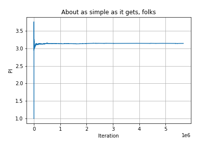

# Montercarlo-Pi
Just for curiosity, generated the PI number by doing a Montecarlo simulation.

By generating 1000000000 random points in a plane we get the first 3 decimals of PI in around 1 min with my current PC, this could be optimized. We count the number of points that are within a square and circle in the plane, both the circle and the square in the plane have the property circle radio = square side length, by doing this and dividing both number circleStack / SquareStack, we get an approximation of PI.

Approximation plotted [Notebook script](./notebook-jupiter/montecarlopi.ipynb)

